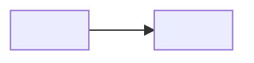

# ARCHITECTURE.md

Accountable: Ryan Linde (Architect, Phase 1).

## The Gate: Build, Buy, or Delegate

Where the Phase 2 system runs and who writes it, for the problem chosen in
[DACI-001](../docs/DACI-001.md): a graduating CS student cannot tell which tools
and frameworks are worth investing learning time in, because employer
expectations move faster than a curriculum does.

**Weights are committed in this commit. No option has been scored yet.** Scores
arrive in a separate, later commit so the order is visible in the history rather
than asserted afterwards.

### Weights (commit before scores)

| Criterion | Weight (1 to 5) | Why |
|---|---|---|
| Fits the job the student is hiring this tool for | 5 | A tool that lists openings without telling a student what to learn next is a job board, and job boards already exist. If it misses this, nothing else it does matters. |
| Team capability in three weeks | 4 | All four of us deployed a Cloudflare Worker and a D1 database in HW4 and HW5. Three weeks leaves no room to learn a platform none of us has shipped on. |
| Switching cost | 3 | Scored from experience rather than guessed: moving data out of the browser in HW4 cost each of us an evening, and `wrangler d1 export` produced a portable file. We know what this number means now. |
| Control of user data | 4 | The system holds a student's own account of what they do not know yet, and which roles they are targeting. Not regulated data, but the kind a user would not want their current employer to read. |
| Cost | 2 | Free tiers exist for every option under consideration. Cost only becomes real past the course, and nothing here is intended to outlive it. |

**Open against this table.** Criterion 1 needs the job statement IDs from
`USERS.md` once the Specifier commits them, in the form the demo uses
(`J-<name>`). Until those exist the criterion is stated in words; the IDs get
added in the scores commit.

### Scores

*Not yet scored. This section is filled in a later commit, after the weights
above have been agreed and merged.*

## ADR-001: <decision>

- **Status:**
### Context
### Options
### Decision
### Consequences
### Revisit Trigger

## Architecture Diagram

