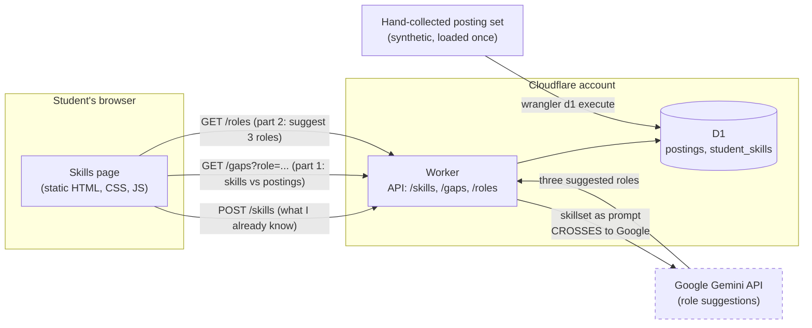

# ARCHITECTURE.md

Accountable: Ryan Linde (Architect, Phase 1).

## The Gate: Build, Buy, or Delegate

Where the Phase 2 system runs and who writes it, for the problem chosen in
[DACI-001](../docs/DACI-001.md): a graduating CS student cannot tell which tools
and frameworks are worth investing learning time in, because employer
expectations move faster than a curriculum does.

**Weights are committed in this commit. No option has been scored yet.** Scores
arrive in a separate, later commit so the order is visible in the history rather
than asserted afterwards.

### Weights (commit before scores)

| Criterion | Weight (1 to 5) | Why |
|---|---|---|
| Fits the job the student is hiring this tool for | 5 | A tool that lists openings without telling a student what to learn next is a job board, and job boards already exist. If it misses this, nothing else it does matters. |
| Team capability in three weeks | 4 | All five of us deployed a Cloudflare Worker and a D1 database in HW4 and HW5. Three weeks leaves no room to learn a platform none of us has shipped on. |
| Switching cost | 3 | Scored from experience rather than guessed: moving data out of the browser in HW4 cost each of us an evening, and `wrangler d1 export` produced a portable file. We know what this number means now. |
| Control of user data | 4 | The system holds a student's own account of what they do not know yet, and which roles they are targeting. Not regulated data, but the kind a user would not want their current employer to read. |
| Cost | 2 | Free tiers exist for every option under consideration. Cost only becomes real past the course, and nothing here is intended to outlive it. |

**Open against this table.** Criterion 1 needs the job statement IDs from
`USERS.md` once the Specifier commits them, in the form the demo uses
(`J-<name>`). Until those exist the criterion is stated in words; the IDs get
added in the scores commit.

### Scores (1 to 5)

Scored after the weights above were committed and opened for review. The three
options are the course's standard doors, read for this problem:

- **Build** — our own Cloudflare Worker, a D1 database, and a static page, the stack all five of us deployed in HW4 and HW5.
- **Buy** — an existing skills or job-data product: a job board with skill extraction, a learning-path catalogue, or a postings API.
- **Delegate** — bolt.new generates the application from our spec and hosts it.

| Criterion | Weight | Build: Worker, D1, static page | Buy: existing skills or job-data product | Delegate: bolt.new generates and hosts |
|---|---|---|---|---|
| Fits the job the student is hiring this tool for | 5 | 5 | 2 | 4 |
| Team capability in three weeks | 4 | 5 | 3 | 2 |
| Switching cost | 3 | 4 | 2 | 2 |
| Control of user data | 4 | 3 | 2 | 2 |
| Cost | 2 | 5 | 2 | 4 |
| **Weighted total (max 90)** | | **79** | **40** | **50** |

**Revised 2026-10-08. Build's control-of-user-data score moved from 4 to 3,
and its total from 83 to 79.** The original 4 rested on nothing leaving our
Cloudflare account. On 2026-10-08 the Implementer confirmed in Teams that the
system has two parts, and that the second one, suggesting three roles from a
student's skillset, sends that skillset to the Google Gemini API. That is a
second vendor and a real crossing, so the score no longer holds at 4.

It moves to 3 rather than 2 because the crossing is still narrower than Buy's or
Delegate's: we choose which fields are sent, the credential stays a Cloudflare
Worker secret, and the postings and the student's stored skill list never leave
D1. **The decision does not change. Build still wins, 79 to 50 to 40.** This is
the Revisit Trigger below firing as intended, recorded rather than quietly
edited; the original score is in this file's git history.

**Notes on the scores.**

- **Buy scores 2 on fit, and that is the whole result.** The nearest products show
  a student openings, or a catalogue of courses. None of them answers the question
  the problem is about: *given what I already know, what should I learn next.* If
  one of them did, this project would not need building.
- **Buy scores 2 on cost, which is unusual for a Buy column.** Job-posting data at
  any useful scale is paid, and LinkedIn's API is effectively closed to student
  projects. The free option is a student reading postings by hand, which is the
  problem rather than a solution to it.
- **Delegate scores 4 on fit and 2 on capability, and both are true at once.** In
  HW5 bolt.new produced a working feature from a specification in minutes. It also
  shipped nineteen dependencies nobody asked for and a hidden instruction file that
  contradicted our standards. We can get a plausible build from it; we could not
  maintain one.
- **Switching cost for Build is 4 rather than 5** because `wrangler d1 export`
  produced a portable file in HW4 and the Worker is one file, but we have only ever
  moved three rows we did not care about. Moving a term's worth of real data is an
  experiment none of us has run.

**On the margin.** Build wins by 29 points out of 90 after the revision above, which is wide enough that a
reviewer should ask whether Buy was scored fairly rather than conveniently. The
honest answer is that Buy loses almost entirely on one criterion, fit, and that
criterion carries the heaviest weight. Drop fit to a weight of 3 and Build still
leads 69 to 36. **The result is not sensitive to that weight; it is sensitive to
whether an off-the-shelf product exists that answers the student's actual
question.** If a reviewer knows one, that is the finding, and it is worth more
than the table.

## ADR-001: Build on Cloudflare Workers and D1

- **Status:** Proposed, 2026-10-07. **Driver: Ryan Linde (Architect).**
  **Approver: proposed Aaron Rahim; the team can name someone else in review.**
  *An ADR without an Approver is a record of whoever typed last, so a proposed
  name is better than a blank. Whoever approves this PR is approving that too.*

### Context

A graduating CS student cannot tell which tools and frameworks are worth
investing learning time in. Employer expectations move faster than a curriculum
does, every company's stack differs, and the student carries the consequence:
`PROBLEM.md` records that not meeting a job description means no job, and that
this is on the student rather than on the college.

The Gate above favours building on the stack all five of us have already
deployed. Three weeks is not long enough to learn a platform none of us has
shipped on, and Build won on the two heaviest criteria rather than on a narrow
total.

**The crossing, named.** A student's self-assessed skill list and their target
roles leave the browser and are stored in a Cloudflare D1 database under
Cloudflare's free-tier terms, in a region Cloudflare selects and we do not
choose. Request metadata, including IP addresses and timestamps, is logged by
Cloudflare by default whether we ask for it or not. This is not regulated data,
but it is a record of what a person does not know yet and which jobs they want,
which is exactly the kind of thing they would not want their current employer or
a classmate to read. **The second crossing, named.** Confirmed by the Implementer on 2026-10-08: the
system has two parts. The first compares a student's skills to the skills in the
postings and stays inside Cloudflare. The second suggests three roles from the
student's skillset, and **to do that the Worker sends that skillset to the Google
Gemini API**, under Google's API terms, with the credential held as a
`GEMINI_API` Worker secret. The student's stored skill list and the postings
stay in D1; what crosses is the skillset as a prompt. This is a second vendor
and a different crossing from the Cloudflare one, and it is why the Gate's
control-of-user-data score for Build was revised from 4 to 3 above.

**The Implementer is accountable for what crosses, as the
author of `TOOLS.md`.** Our roster lists two Implementers, Nuhamin and Aaron, and
`TOOLS.md` is currently being written by Aaron, so this names the role rather
than guessing the person; whoever owns that file should put their name here. The
row passes to the Phase 2 Implementer at rotation with a dated note.

**Where the job-posting data comes from is part of this decision.** Live posting
data at any useful scale is paid or restricted, and scraping it raises terms
problems the team cannot resolve in three weeks. The system therefore reads a
**hand-collected, synthetic posting set loaded once** with
`wrangler d1 execute`. That is a real limitation and it is named again under
Consequences rather than buried here.

### Options

Build (our own Worker, D1, and a static page), Buy (an existing skills or
job-data product), and Delegate (bolt.new generates and hosts the application).
Scored in the Gate above: **79, 40, and 50 out of 90** after the 2026-10-08
revision to Build's control-of-user-data score.

### Decision

Build. One Cloudflare Worker serves the API. A D1 database holds two tables: the
collected postings with their extracted skills, and each student's own skill
list. A static page calls the Worker, submits what the student already knows,
and renders the gap: the skills that appear most often in postings for their
target role and least often in their own list.

**The system has a second part**, confirmed by the Implementer on 2026-10-08:
from the same skillset it suggests three roles the student could target. That
suggestion is not computed from D1. The Worker sends the skillset to the Google
Gemini API and returns what comes back. It is the only part of this design that
leaves our Cloudflare account, it is drawn as the one dashed box in the diagram
below, and it is the reason Build's control-of-user-data score is 3 and not 4.

No login, because no authenticated user model exists and inventing one in three
weeks would cost more than the feature it protects.

### Consequences

- **Easier:** every member can read and deploy every part of it. All five of us
  shipped this exact stack in HW4 and HW5, so nobody is learning the platform and
  the build.
- **Easier:** nothing about a student's skill list leaves our Cloudflare account.
- **Harder: the posting data is a frozen snapshot.** The problem is that industry
  expectations move faster than curricula do, and the answer we ship reads a file
  collected once in October. A tool about change that cannot see change is the
  sharpest tension in this decision, and we are accepting it because the
  alternative is paid data we do not have. *(No feature ID: `FEATURES.md` is
  still the template stub on main, so there are no IDs to cite yet. This line
  gets one when the Specifier commits the rows.)*
- **Harder: skill names do not normalise themselves.** "React", "React.js",
  "ReactJS", and "front-end framework" are the same skill to a hiring manager and
  four different strings to a database. Somebody has to decide how much of that we
  solve. *(No feature ID yet, same reason as above.)*
- **Harder: the endpoint has no authentication.** Anyone with the URL can read or
  write any student's skill list. This is the same hole two of us shipped in HW4
  and recorded as a known FAIL; repeating it knowingly on a second project is
  worse than meeting it the first time. Acceptable for a course project holding
  synthetic data, and the first thing ADR-002 must address.

### Revisit Trigger

Any one of these:

- **Before this holds a real student's data**, the authentication hole above must
  be closed. That is ADR-002 and it is owed before anyone outside the team uses it.
- A source of current posting data becomes available legally and free, which would
  change both the Gate's Buy column and the frozen-snapshot consequence.
- Cloudflare changes the free-tier limits, the region, or the terms.
- Skill normalisation turns out to need more than three weeks, at which point the
  scope question comes back to the team rather than to the Architect.

## Architecture Diagram

Matches ADR-001 box for box: every box below appears in the Decision above, and
nothing in the Decision is missing from the diagram.

The dashed box is deliberate: **`G` is the only box outside our Cloudflare
account**, and the arrow into it is the crossing named in the Context. A diagram
that left it out would disagree with `TOOLS.md`.

---

## Open against this ADR

Three things this record does not settle, stated rather than left blank.

**1. RESOLVED 2026-10-08. The Gemini crossing is real and is now in this ADR.**
Asked in Teams on 2026-10-07 and again in review on PR #9. The Implementer
answered on 2026-10-08: the product has two parts, and the second, suggesting
three roles from a student's skillset, is where the crossing to Google Gemini
happens. The Context above now names that crossing, the diagram now shows it as
the only box outside our Cloudflare account, and Build's control-of-user-data
score moved from 4 to 3 with the reasoning recorded under the scores table. The
decision itself did not change.

What is still open underneath it: nobody has written down **which fields** of the
skillset are sent to Google, or whether anything identifying the student can ride
along with them. The crossing is named; its width is not. That belongs in
`TOOLS.md` and is owed before this holds a real student's data.

**2. The Approver is proposed, not agreed.** See the Status line.

**3. No feature IDs.** `FEATURES.md` is still the template stub on `main`. The
two Consequences marked above get IDs as soon as the Specifier commits rows.
