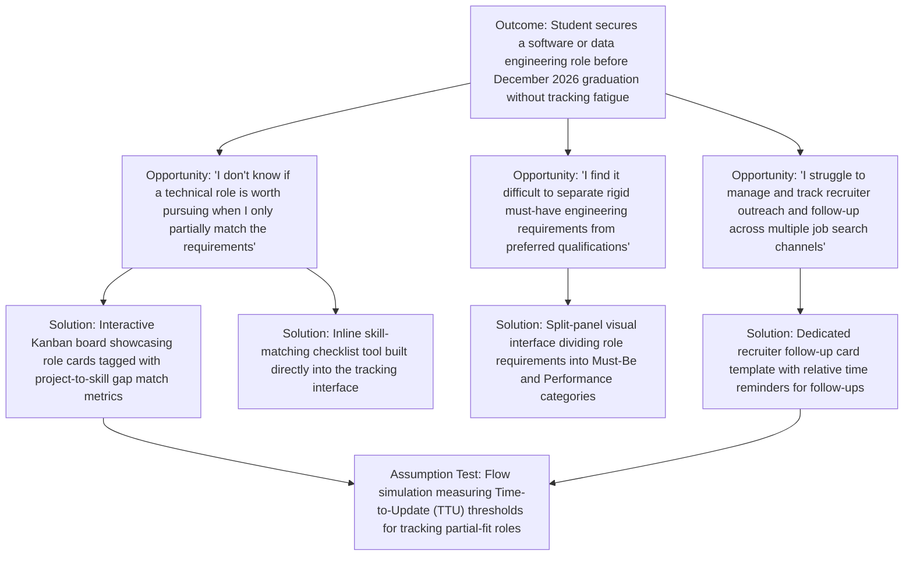

# EVALS.md

Status: ACTIVE
Accountable Role: Reviewer (Phase 1)

## Opportunity Solution Tree

## Riskiest Assumption (RAT)

### 1. The Core Hypothesis
Senior Computer Science students facing tight graduation timelines will consistently log, maintain, and action their multi-channel technical job applications if the system reduces data-entry overhead and clearly flags technical role fit using their existing project experience as a signal.

### 2. The Riskiest Assumption
**Users will completely abandon the application within 7 days if logging partial-match technical requirements or updating multi-stage interview rounds requires manual, multi-field text entry.** If immediate, low-friction pipeline transitions (such as moving a card from *Applied* to *Technical Interview*) are absent, the application transforms into an administrative burden that forces students to revert to memory or generic spreadsheets.

### 3. The Test Design
We will evaluate this specific user friction point in Phase 2 using a low-fidelity interactive flow simulation with 5 active job-seeking senior students.
* **Metric:** Time-to-Update (TTU) and Task Success Rate.
* **Success Threshold:** Participants must successfully update a job card's status across three pipeline stages (e.g., *Applied -> Phone Screen -> Technical Interview*) and separate a preferred technology qualification into the appropriate view in under 8 cumulative seconds, using fewer than 3 clicks per action, with zero structural errors.
* **Pivot Trigger:** If 2 or more participants express confusion, exceed the 8-second timing threshold, or fail to complete the status modification sequence, the UI design fails the RAT, triggering an immediate rollback and redesign of the application state machine before any automated matching algorithms are coded.

## Evals Planned for Phase 2

1. **Accessibility Validation Audit:** An automated and manual assistive technology scan verifying that all technical role input forms and pipeline cards utilize explicit semantic `<label>` tags and `role="alert"` boxes, targeting a clean report with zero uncaught ARIA announcement failures.
2. **Resilience Input Failure Test:** A sequence of 10 simulated client storage interruptions triggered exactly during application state submission. Success means 100% of user-entered strings (job titles, requirements, tech stacks) are safely preserved inside the browser view fields without data loss.
3. **Data Security and Injection Scan:** A code inspection covering all rendering boundaries to ensure user-supplied text strings are processed exclusively via `.textContent` assignments, guaranteeing that zero malicious scripts can execute within the application pipeline.

## Prediction Stakes

*Each member commits their own stake in an individual Git commit before Phase 2 execution begins. Results will be logged directly beneath each line upon phase completion.*

*   **Specifier (@PrinceMu):** "Given a dashboard layout displaying 10 incoming technical roles, users will group, sort, and isolate the must-have skills from preferred toolsets for at least 8 of them within their first 5 minutes of system interaction."
    *   *Result:* [To be written upon completion of Phase 2 testing]
*   **Architect (@ryanlinde-gif):** "Isolating the job description matching array and storing requirements data entirely in client-side memory rather than triggering server round-trips will maintain pipeline card drag-and-drop transitions under 100ms."
    *   *Result:* [To be written upon completion of Phase 2 testing]
*   **Implementer (@nuhamin22):** "Enforcing isolated script scopes and strict semantic structures will allow the job tracking layout to handle 50 concurrently active role cards without experiencing rendering stutter or layout shifting."
    *   *Result:* [To be written upon completion of Phase 2 testing]
*   **Implementer (@aaronsarasota4):** "Enforcing absolute form control associations will allow users navigating via keyboard alone to fully populate, categorize, and submit a new tech company pipeline card as rapidly as mouse-using peers."
    *   *Result:* [To be written upon completion of Phase 2 testing]
*   **Reviewer (@cad3nnn - My Stake):** "If the tracking board displays absolute calendar deadline dates instead of relative urgency time windows (e.g., 'In 2 days' vs 'October 10'), user interaction rates for updating overdue technical application statuses will decline by more than 30%."
    *   *Result:* [To be written upon completion of Phase 2 testing]

## Where the Stakes Disagree

The stakes diverge fundamentally on what drives system abandonment and platform efficiency during a tight graduation timeline. The **Specifier** bets that user value hinges on the upfront filtering logic of separating must-have vs. preferred requirements. In contrast, the **Reviewer** assumes that ongoing behavioral micro-feedback (relative vs. absolute time presentation) dictates whether a student will keep using the tool.

Furthermore, a deliberate engineering tradeoff exists between the engineering roles: the **Architect's** performance targets rely heavily on browser-level client data structures, creating a point of friction with the **Implementers'** focus on clean, robust semantic HTML structures and accessible input controls if massive job listings scale up rapidly during the sprint.
