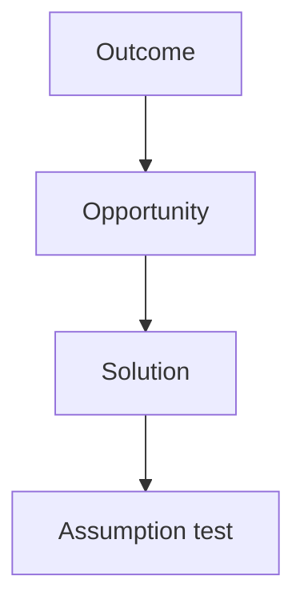

# EVALS.md

Stub from mgt3745-group-template. Accountable: the Reviewer (teams of five: the Evaluator from Phase 2).

## Opportunity Solution Tree

## Riskiest Assumption (RAT)

## Evals Planned for Phase 2

## Prediction Stakes

Each member commits their own stake, in their own commit, before any Phase 2 code. Predictions are never edited; results are written beneath them.

### Prince (Specifier)

Committed before the bolt.new probe on FEATURES.md

- **Tight:** bolt.new will add a login, signup, or other authentication screen, even though FEATURES.md never mentions access.
- **Loose:** bolt.new will invent its own sample posting data in the code instead of calling an outside API or reading data we supplied.
- **Open:** bolt.new will add at least one library or framework beyond plain HTML, CSS, and JavaScript.

Results: 

- Tight: false. bolt.new added no login or signup. Its migration says the app has no authentication.
- Loose: mostly true. bolt.new generated 89 postings, but in a seed migration loaded into a Supabase database, not in the page code. The app reads them through Supabase.
- Open: true. bolt.new added React, Vite, TypeScript, Tailwind, a Supabase client, and Lucide icons, 18 direct packages in all.
> The eval list and the RAT are the Reviewer's artifact and are not written yet,
> so this stake names what it measures in words rather than an eval number.
> Renumber the headings to match once the list exists; do not edit the numbers
> in the predictions themselves.

### Stake: Ryan Linde (Architect), committed 2026-10-07

**Is the hand-collected posting set big enough to rank skills at all?**
ADR-001 accepts a frozen, hand-collected posting set because live posting data
is paid or restricted. That is the decision I am most likely to be wrong about,
so it is the one I am staking.

I predict we need **at least 120 postings for a single role** before the top
five skills stop moving. Measured by dropping a random 10% of the postings and
recomputing the ranking, five trials per set size: at 60 postings **at least 3
of 5 trials** change the top five; at 120 postings **at most 1 of 5** does.

If the ranking is already stable at 60, the Consequences section of ADR-001 is
too pessimistic and the collection work is smaller than I told the team. If it
is still unstable at 120, the product does not have a data problem it can fix
by collecting harder, and we should reopen the Gate rather than ship a ranking
we cannot defend.

**Does the Worker stay fast enough to feel like a page, not a job?**
The Gate scored team capability 4 for Build largely on the fact that all of us
have deployed a Worker. Cold start on D1 is the part of that I am least sure of.

I predict **20 of 20 warm requests to the gap endpoint return under 1.5 s** on
campus Wi-Fi, and **at least 4 of 20 first requests after 10 minutes idle go
over 1.5 s**. If cold starts are not visible at all, the capability score of 4
was conservative and I should say so in writing rather than quietly bank it.

## Where the Stakes Disagree
