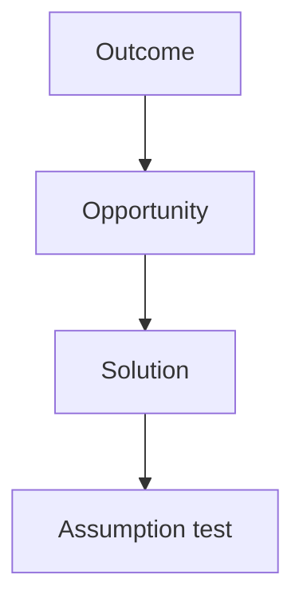

# EVALS.md

Stub from mgt3745-group-template. Accountable: the Reviewer (teams of five: the Evaluator from Phase 2).

## Opportunity Solution Tree

## Riskiest Assumption (RAT)

## Evals Planned for Phase 2

## Prediction Stakes

Each member commits their own stake, in their own commit, before any Phase 2 code. Predictions are never edited; results are written beneath them.

### Prince (Specifier)

Committed before the bolt.new probe on FEATURES.md

- **Tight:** bolt.new will add a login, signup, or other authentication screen, even though FEATURES.md never mentions access.
- **Loose:** bolt.new will invent its own sample posting data in the code instead of calling an outside API or reading data we supplied.
- **Open:** bolt.new will add at least one library or framework beyond plain HTML, CSS, and JavaScript.

Results: 

- Tight: false. bolt.new added no login or signup. Its migration says the app has no authentication.
- Loose: mostly true. bolt.new generated 89 postings, but in a seed migration loaded into a Supabase database, not in the page code. The app reads them through Supabase.
- Open: true. bolt.new added React, Vite, TypeScript, Tailwind, a Supabase client, and Lucide icons, 18 direct packages in all.

## Where the Stakes Disagree
